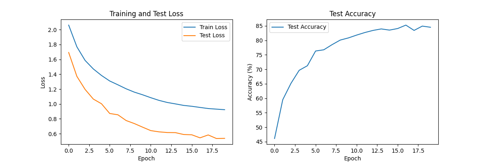

# MNIST Digit Classifier

A web application for classifying handwritten digits using a trained convolutional neural network (CNN) model.

The latest version of the web application can be accessed here:

https://digit-prediction-project-v2-839541782615.europe-west2.run.app/

## Features

- Draw digits on a canvas
- Get real-time predictions with confidence scores
- View statistics on prediction accuracy
- Provide feedback by specifying the true digit
- Track performance metrics in a PostgreSQL database
- Visualise confidence distribution across all digits

## Technologies Used

- PyTorch for model development and inference
- Streamlit for the web interface
- PostgreSQL for data storage
- Docker for containerisation and deployment
- Google Drive for deploying the web application

## Project Structure

- `model/`: CNN model definition and training code
- `streamlit/`: Web application code
- `results/`: Visualisation outputs
- `tests/`: Test scripts to verify functionality

# The Convolutional Neural Network Model

PyTorch implementation of a Convolutional Neural Network (CNN) for MNIST digit classification.

Run the script `python run_model.py` in the parent directory to train the model (default 20 epochs) and generate a visualisation for the prediction of 8 random test numbers.

Example visualisation (can be found in /results folder):


There is a visualisation representing the model's training progress over the epochs (can be found in /plots folder):


## Model Architecture

The currently implemented architecture of the CNN Model:

1. **Convolutional Layers**:

   - First layer: 1 input channel (grayscale) → 16 output channels, 3×3 kernel with batch normalisation
   - Second layer: 16 input channels → 32 output channels, 3×3 kernel with batch normalisation
   - ReLU activation and spatial dropout (25%) after each convolutional layer

2. **Pooling & Regularisation**:

   - Max pooling with 2×2 kernel after the first and second convolutional layers
   - Dropout (50%) in fully connected layers
   - L2 regularisation (weight decay) in the optimiser

3. **Fully Connected Layers**:
   - First layer: 32 × 7 × 7 input features → 64 output features
   - Second layer (output): 64 input features → 10 output features (one for each digit)

## Training Process in train.py

The training pipeline includes several techniques to combat overfitting:

1. **Data Augmentation**:

   - Random rotation up to 45 degrees
   - Random affine transformations (translation, scaling, shearing)
   - Normalisation using MNIST mean (0.1307) and std (0.3081)

2. **Training Strategy**:

   - Dataset split into training (80%) and validation (20%) sets
   - Separate test set for final evaluation

3. **Regularisation Methods**:
   - High dropout rates (25% for convolutional layers, 50% for fully connected layers)
   - Weight decay (1e-3) in Adam optimiser
   - Batch normalisation in convolutional layers

## Deployment Notes

### Create a virtual environment

```bash
python -m venv venv
# Activate the virtual environment
source venv/bin/activate  # On Windows use `venv\Scripts\activate`
# Install the required dependencies
pip install -r requirements.txt
```

### Running the Model

To train and test the MNIST classifier model:

```bash
# Train the model (default 20 epochs)
python run_model.py --mode train

# Test the model with visualizations
python run_model.py --mode test

# Train and then test
python run_model.py --mode both

# Additional options
python run_model.py --help  # View all available options
```

### Running the Streamlit App

To run the Streamlit web application locally:

```bash
# Run the Streamlit app
python run_streamlit.py

# Alternatively, use Streamlit directly
streamlit run streamlit/app.py
```

### Setting Up SQL Connections

To set up and manage SQL connections for the MNIST Classifier application, follow these steps:

Ensure you have the following environment variables set up in your `.env` file or in your environment:

```env
DB_HOST="your_database_host"
DB_PORT="your_database_port"
DB_NAME="your_database_name"
DB_USER="your_database_user"
DB_PASSWORD="your_database_password"
DB_INSTANCE_CONNECTION_NAME="your_cloud_sql_instance_connection_name"  # Only if using Google Cloud SQL
```

### Deploying to Google Cloud

To build and deploy the Docker container to Google Cloud:

```bash
# Build and submit the Docker image to Google Cloud
gcloud builds submit --tag (your zone of choice)-docker.pkg.dev/(project id)/(gc-repository-name)/(your-image):(name-tag)
```

### Quick Setup Guide

For a quick setup and deployment walkthrough, watch this video:
[Google Cloud Run Deployment Tutorial](https://www.youtube.com/watch?v=sqUuofLBfFw&t=229s)
