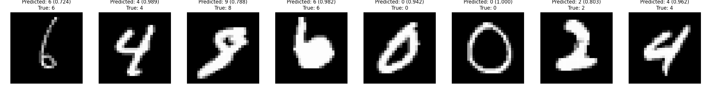

# MNIST Classifier Model

PyTorch implementation of a Convolutional Neural Network (CNN) for MNIST digit classification.

Run the script `run_model.py` in the parent directory, it trains the model and generates a visualisation for the prediction of 5 numbers.

Example visualisation (can be found in /results folder after each generation):


# MNIST Digit Classifier

A web application for classifying handwritten digits using a trained neural network model.

## Features

- Draw digits on a canvas
- Get real-time predictions with confidence scores
- View statistics on prediction accuracy
- Store predictions in a PostgreSQL database

## Local Development

### Setup

1. Clone the repository:
   ```
   git clone <repository-url>
   ```

2. Install dependencies:
   ```
   pip install -r requirements.txt
   ```

3. Set up environment variables in a `.env` file:
   ```
   POSTGRES_HOST=localhost
   POSTGRES_PORT=5432
   POSTGRES_DB=mnist_db
   POSTGRES_USER=postgres
   POSTGRES_PASSWORD=
   MODEL_PATH=saved_models/mnist_classifier.pth
   ```

4. Run the application:
   ```
   python run_streamlit.py
   ```

## Access the application at:

## Database Schema

The application uses a PostgreSQL database with the following schema:

- `predictions` table:
  - `id`: Serial primary key
  - `timestamp`: Timestamp of the prediction
  - `predicted_digit`: The digit predicted by the model (0-9)
  - `confidence`: The confidence score of the prediction (0-1)
  - `true_label`: The true label provided by the user (optional)
  - `image_data`: Binary data of the drawn image

## Files

- `model.py`: defines the CNN architecture
- `train.py`: contains the training loop and evaluation functions
- `inference.py`: provides utilities for making predictions with the trained model
- `mnist_classifier.ipynb`: Jupyter notebook demonstrating the model

## Model Architecture

The model is a Convolutional Neural Network (CNN) with the following architecture:

1. **Convolutional Layers**:

   - First layer: 1 input channel (grayscale) → 10 output channels, 5x5 kernel
   - Second layer: 10 input channels → 20 output channels, 5x5 kernel
   - Each followed by ReLU activation and 2x2 max pooling

2. **Fully Connected Layers**:

   - First layer: 320 input features → 50 output features
   - Second layer: 50 input features → 10 output features (one for each digit)

3. **Regularization**:
   - Dropout after second convolutional layer
   - Dropout after first fully connected layer

## Training Process

The training process in `train.py` includes:

1. Using pre-loaded MNIST dataset via DataLoaders
2. Training the model using Adam optimizer with Cross Entropy Loss
3. Evaluating the model on a test set after each epoch
4. Tracking and plotting training history (losses and accuracy)
5. Saving the trained model

## Inference

The `inference.py` file provides the `MNISTPredictor` class for making predictions:

1. Loads the trained model
2. Preprocesses input images (resize, normalize)
3. Handles different input formats (PIL Image, numpy array, or PyTorch tensor)
4. Makes predictions and returns:
   - Predicted digit (0-9)
   - Confidence score
   - Probabilities for all digits

## Using the Model

You can use the model in several ways:

### 1. Using run_model.py

The main script `run_model.py` in the parent directory provides a command-line interface:

```bash
# Train the model
python run_model.py --mode train

# Test the model
python run_model.py --mode test --test-samples 8

# Both train and test
python run_model.py --mode both
```

Command line options:

- `--mode`: train, test, or both
- `--epochs`: number of training epochs
- `--batch-size`: batch size for training
- `--learning-rate`: learning rate for optimizer
- `--model-path`: path to save/load the model
- `--no-cuda`: disable CUDA training
- `--test-samples`: number of test samples to visualize

### 2. Using the Jupyter Notebook

The `mnist_classifier.ipynb` notebook provides an interactive demonstration of the model:

1. Model definition and training
2. Visualization of training history
3. Testing on sample images
4. Visualization of prediction probabilities

## Requirements

- PyTorch
- torchvision
- NumPy
- Matplotlib
- PIL (Pillow)

These dependencies are listed in the `requirements.txt` file in the parent directory.
